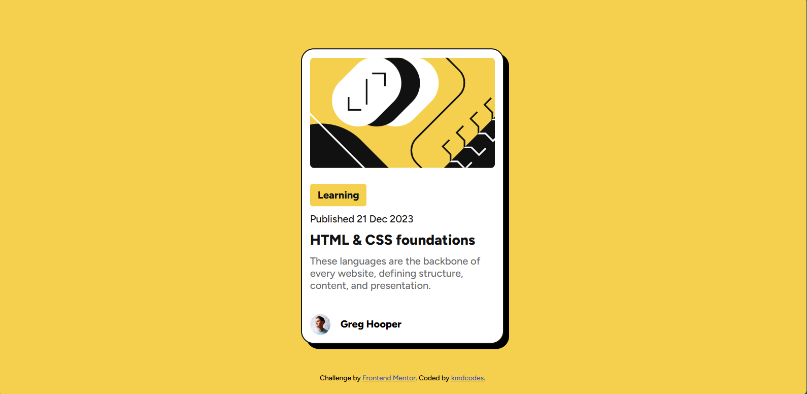
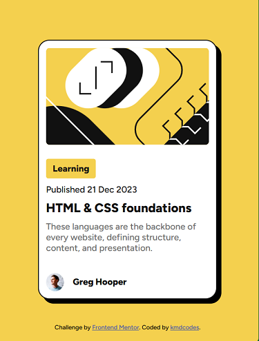

# Frontend Mentor - Blog preview card solution

This is a solution to the [Blog preview card challenge on Frontend Mentor](https://www.frontendmentor.io/challenges/blog-preview-card-ckPaj01IcS). Frontend Mentor challenges help you improve your coding skills by building realistic projects. 

## Table of contents

- [Overview](#overview)
  - [The challenge](#the-challenge)
  - [Screenshot](#screenshot)
  - [Links](#links)
- [My process](#my-process)
  - [Built with](#built-with)
  - [What I learned](#what-i-learned)
  - [Continued development](#continued-development)
  - [Useful resources](#useful-resources)
- [Author](#author)

**Note: Delete this note and update the table of contents based on what sections you keep.**

## Overview

### The challenge

This is a simple HTML and CSS challenge from Frontend Mentor. It was designed to test one's ability to build responsive webpage component. 

In this challenge, I was expected to create a blog preview component and position it at the center of the screen irrespective of the screen size. It also tested my ability to make the page responsive by adding the focus and hover states.

### Screenshot

### Links

- Solution URL: [GitHub](https://github.com/kmdcodes/blog-preview-card-main)
- Live Site URL: [Blog Preview Component](https://blog-preview-card-main-gules-tau.vercel.app/)

## My process

### Built with

This solution was simply built with the following:
- Semantic HTML5 markup
- CSS custom properties
- Flexbox
- Mobile-first workflow
- Figtree Google Font [Figtree](https://fonts.google.com/specimen/Figtree)

### What I learned

During this project I experimented more with Flexbox, as well as other CSS properties such as box-shadow, creation of custom variables, use more of the 'rem' values in all measurements. 

In this project, I practice how to centre the element without the necessarily over using the position property. 

In it I also experimented and implemented simple hover effects.

### Continued development

Areas I wil definitely focus on it future projects will be 
- Flexbox and Grid
- Adding amazing shadows on components.
- Drawing or styling components to have curvy or irregular shapes other than the traditional rectangle.

### Useful resources

- [Microsoft Copilot](https://copilot.microsoft.com/) - This is the one tool I fall to when I struggled with any styling. It was of tremendous help provided the prompts were specific enough. However, it was only used sparingly during the designe of this solution.

## Author

- K.M. Daniel (kmdcodes)
- Frontend Mentor - [@yourusername](https://www.frontendmentor.io/profile/yourusername)
- Twitter - [@yourusername](https://www.twitter.com/yourusername)
